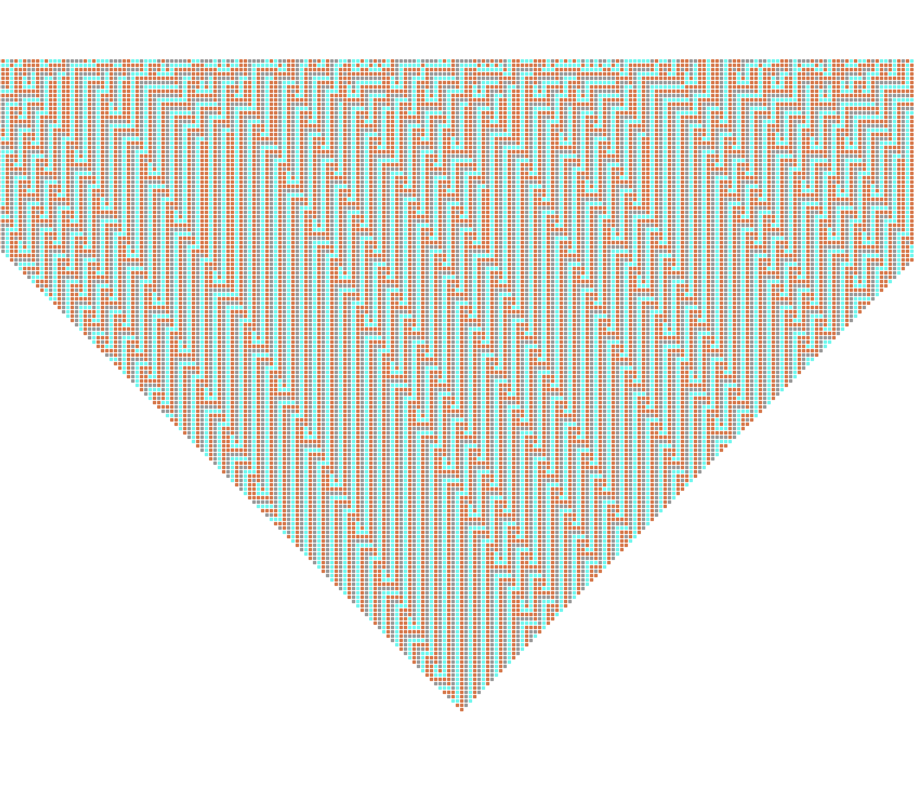

# [アサリの模様 シミュレーター](https://michiharu.github.io/asari/)
高校時代に複雑系の本を読んで以来、いつか試したいと思っていたのが一次セルオートマトンのシミュレーターです。

[アサリの模様 シミュレーター](https://michiharu.github.io/asari/)

## 初期バージョン
通常の『一次セルオートマトン』の変形バージョンが10時間ほどで完成しました。

通常は1行づつ両端の2セルが減っていくため全体としては三角形の形になります。
変形型は端の2セルについてのルールも設定するものだったので、すべての行のセルの数が変わらない長方形のものでした。

また、最初の1行のセル１つ１つを自分で色を設定できるようにしていました。

## パフォーマンス改善バージョン（現在）
しばらく初期バージョンで満足していたのですが、『一次セルオートマトン』で画像検索すると私が作成したものが変形型であることを知りました。
また、どの画像も私のものよりもはるかにたくさんのセルを表示させていたので、私のシミュレーターも同じようにしたいと考えました。

まず次の2つの機能を削除しました。

- 端のルール設定
- 1行目のセルごとの色変更

次に初期バージョンはDiv要素でセルを表現していましたが、要素数が1万を超えたあたりで再レンダリング完了までに10秒以上掛かっていました。

そのため、canvas上にレンダリングするようKnovaというライブラリーを使って改善しました。
[Konva.js - HTML5 2d canvas js library for desktop and mobile applications](https://konvajs.org/)

これによってかなり速度が改善し、現在22,801個のセルのレンダリングが1秒程度で済むようになりました。

この改善だけでも5時間ほど費やしています。

## 残タスク
やるかどうかはわかりませんが、もし改良するならというポイントを挙げてみます。

### ルールのエクスポート & インポート
現在はアプリがロードされたタイミングでランダムなルールを表示させています。そしてルールを変更していくことでいろいろな模様が観察出来ます。

私がこれまで見たもので一番面白いと思ったのは以下の模様です。

面白いと思った模様をエクスポートできたり、人のお勧め模様をインポートできるといいなと思います。

（一次セルオートマトンにそんな需要あるかわかりませんが）

### Drawerの導入
[Drawer](https://mui.com/components/drawers/)を使っていないのでスマホの画面で見ると残念です。
Drawerなら改善出来ます。Topバーも設置して、アプリのタイトルはバーに納めたいですね。

### 設定項目の追加
現在はセルのサイズ、最初の行のセル数などは定数で定義しています。
state として管理して数値の変更のためのインターフェースを設置すれば見たい規模感で見れるようになります。

